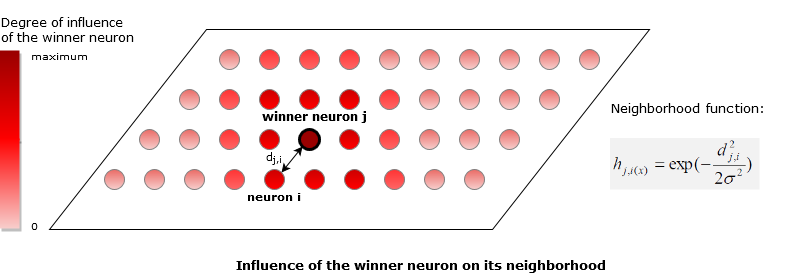
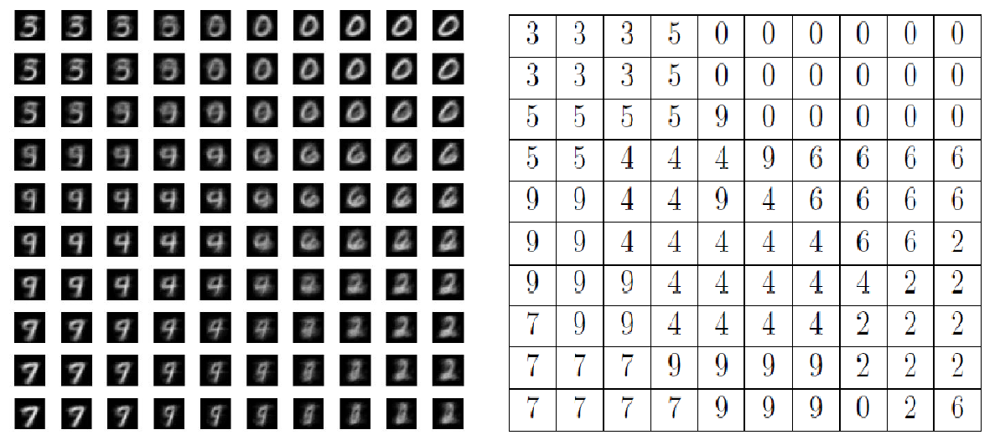

# Self-organising Map for handwritten number classification

### Synopsis ###
This project took place during the module _Neural networks_ at NUS (EE5904R).
The goal of this project is to classify handwritten digits from MNIST dataset by using a Self-organising Map (SOM). 

Self-organising Map is a type of neural network that are useful to give low-dimensional representation of the input space of the training samples (in our case, two-dimensional). This artificial neural network is made of only two fully-connected layers: 

* an input layer 
* a particular type of output layer: it consists of a two-dimensional map that is called the _lattice_. This lattice is characterized by a topological organization and the location of the output neurons on the lattice is important! In our case, the dimensions of the lattice are set to 10 x 10, thus there are 100 output neurons. 

The following image illustrates this structure:

  

A SOM is trained under unsupervised learning: each output neuron on the lattice is caracterized by its weights and these weights are adapted based upon the input samples only. The labels of the input samples are not taken into account for the training phase. The main steps of the learning process are the following (Matlab script 'train_SOM'): 

1. Select randomly an input vector _x_ from the training set
2. Determine the winner output neuron (competitive process): the neuron of the SOM which is the closest to the selected input vector _x_, in terms of euclidean distance. I wrote the Matlab function _find_winner(data, x)_ to evaluate the closest vector of a data set from a given input vector _x_. The winner neuron is illustrated on the picture below (the darkest).
3. Update the weights of the neurons of the SOM by using a neighborhood function. In our case, the neighborhood function is a Gaussian function that depends on the distance between the neuron considered (i) and the winner neuron (j) in the lattice. The closer a neuron is from the winner neuron in the lattice, the higher the value of the neighborhood function is and the more affected the neuron is. The weights update is "bigger" for a high value of the neighborhood function. The following picture illustrates the neighborhood function principles:

  

By following the steps above iteratively, the weights of the output neurons follow the distribution of the input signals.

The training phase is followed by a testing or mapping phase to classify a new input vector (Matlab script 'test_SOM'). The classification of a new input vector is simply done by determining its closest output neuron of the lattice. 

### Results ###

For the classification task, all digits from 0 to 9 have been taken into account, except the digits 1 and 8. The steps previously mentionned have been followed to train the SOM. 

After the training step (10000 iterations), I wanted to know whether the training was effective and whether the output neurons are organized in an meaningful way. For each output neuron of the lattice, I determined which input signal stimulate the particular neuron the most. In other words, which input signal is the closest of that output neuron. Then I attributed the label of the input signal to the neuron of the lattice. It gives the following result (left: visualization of the weights of the output neurons ; right: attributed labels).

  

We can almost determine all numbers represented on the left picture. Some numbers are easily recognizable, for example the numbers 0, 2, 6, because the form of these numbers is distinctive from the others. On the other hand, there are some confusions for a few numbers, such as the number 4 which looks like the number 9, and the number 3 looks like the number 5. It appears on the map that the numbers which look like to each other are close in the map : the numbers 7, 9 and 4 are on the lower left corner and the numbers 3 and 5 are on the upper corner. The closer the form of two numbers are, the closer they are
located on the map. It results from the topological organization of the SOM.

Concerning the testing phase (classification of new input samples), it gives an error rate of 29% after 10000 iterations of the learning phase. This result is quite high but can be improved after tuning some parameters. For instance, I change the standard deviation of the Gaussian function which is used as neighborhood function (this parameter is called effective width). The effective width defines the influence of the winner neuron on its neighboors in the lattice. If the effective width is smaller, the winner neuron has less influence on the neurons around him. So the weights of the neighboors change less and give more accurate results. By reducing the effective width by a factor 4, I got an error rate of 22%.

Even though the results obtained by SOM algorithm are not as high as those obtained by a classic Multilayer Neural Network, Self-organizing maps can still useful in terms of representation of the input space of a dataset: it enables us to feel how a dataset "look like".

### Project content ###

Programming language: Matlab

Content of this project: 

* 'MNIST_dataset.mat': MNIST dataset
* 'init.m': Matlab script to initialize the program (load the dataset 'MNIST_dataset.mat' into the Matlab workspace) 
* other Matlab files ('.m' extension): Matlab functions and scripts to run the program

To make the program run: 

1. run _init_
2. run _train_SOM_ to build a SOM and train it
3. run _viz_SOM_ to visualize the weights of the SOM
4. run _test_SOM_ to use the SOM to classify the samples of the test dataset

### Author ###

Mareva Brixy (marevabrixy@gmail.com)
